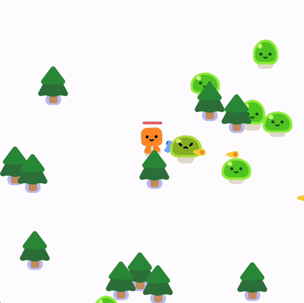

# Godot Rogue Lite with Rust

A simple rogue-like game using Godot and the Rust scripting language.

## Description
This is a basic rogue-lite game created with Godot Engine. I customized the original tutorial to use the Rust extension instead of GDScript for scripting.

## Getting Started
1. Install [Godot Engine](https://godotengine.org/).
2. Clone the repository.
3. `cargo build` in the `gamecore` folder
4. Open the project under `godot` folder in Godot.

## Resources
- **Original Tutorial**: [Create your first 2D Game From Zero with Godot4](https://www.gdquest.com/tutorial/godot/2d/first-2d-game-godot-4/)  - [Github project](https://github.com/gdquest-demos/getting-started-with-godot-4/)
- **Rust Extension for Godot**: [Gdext](https://github.com/godot-rust/gdext)

Feel free to contribute or modify the code as needed!

Happy coding!